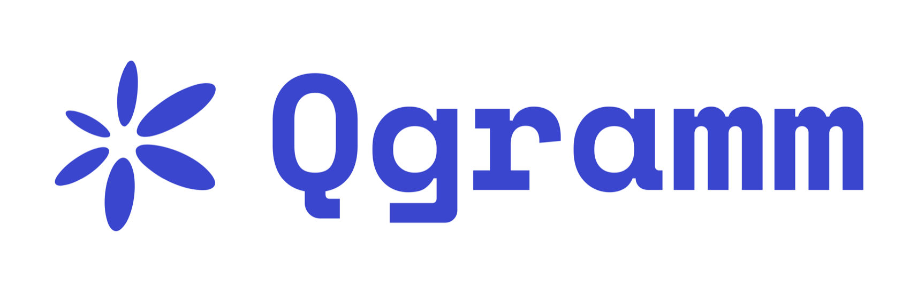

# QGramm

<p align="center">
  <a href="https://github.com/mgg789/QGramm"></a>
</p>

<p align="center">
  <a href="https://github.com/mgg789/QGramm/releases/latest"></a>
  <a href="LICENSE"></a>
  <a href="go.mod"></a>
  <a href="Dockerfile"></a>
  <a href="docs/openapi.json"></a>
</p>

**Добавьте чаты в свой продукт, не внедряя чужое приложение для общения.** QGramm — самохостируемый Go-сервис для истории сообщений, надежной доставки и прав доступа. Подключите его к своим пользователям, интерфейсу и системе идентификации.

Исходное Swift-приложение сохранено в ветке `messenger`. Разработка нового ядра идет в `dev`; история Git сохранена. Лицензия — Apache-2.0.

## Почему команды выбирают QGramm

Ваш продукт сохраняет собственную систему аккаунтов, интерфейс и клиентские приложения. QGramm предоставляет серверную часть чатов: HTTP API, события WebSocket, историю сообщений и восстановление доставки после переподключения, подтверждения устройств, права доступа и дополнительные модули для файлов, групп, MLS-шифрования и AI-участников.

Сервис запускается одним контейнером с SQLite и постоянным дисковым томом. Выбранные в TOML функции исключаются из бинарника при сборке. Backend интегратора управляет пользователями и доступом, а клиенты реализуют API и клиентскую криптографию.

## Где подойдет лучше всего

- **Поддержка клиентов:** чат клиента с вашей командой внутри существующего приложения.
- **Общение пользователей:** личные и групповые чаты с вашими аккаунтами, ролями и интерфейсом.
- **AI-сценарии:** AI-участники в чатах, разрешения на инструменты, scoped-поиск по знаниям или отдельный MLS endpoint.

QGramm подходит командам, которым нужны встраиваемые чаты и контроль над развертыванием. Для готового продукта с федерацией лучше подойдут Matrix или Zulip; для передачи событий без семантики чатов — Centrifugo или NATS. Таблица ниже сравнивает их назначение.

| Проект | Основное назначение | Хранение и развертывание | Шифрование | Что остается приложению |
|---|---|---|---|---|
| **QGramm** | Встраиваемые чаты поддержки, пользователей и AI | Go-контейнер; SQLite и volume файлов | HPKE до контейнера; опциональный MLS E2EE с [public member commits](docs/e2ee.ru.md) | Идентификация, UI, клиентская криптография и медиа; внешний TURN |
| [Matrix / Synapse](https://element-hq.github.io/synapse/latest/setup/installation.html) | Федеративный обмен сообщениями, экосистема клиентов | Homeserver; для production рекомендуется PostgreSQL; медиахранилище | Клиентский [Olm/Megolm E2EE](https://spec.matrix.org/v1.18/olm-megolm/) | Интеграция клиента, развертывание и медиасервисы по необходимости |
| [Centrifugo](https://centrifugal.dev/docs/server/history_and_recovery) | Транспорт real-time pub/sub | Go-сервер; память или внешний broker; ограниченный кеш восстановления | Шифрование payload реализует приложение | Постоянная БД чатов, ACL, вложения, звонки и AI |
| [Zulip](https://github.com/zulip/zulip/blob/main/docs/production/deployment.md) | Готовый командный чат с темами и поиском | PostgreSQL, RabbitMQ, Redis, Memcached; хранилище загрузок | [E2EE мобильных push](https://docs.zulip.com/security/); обычный чат доступен серверу | Настройка продукта; интеграция внешнего провайдера звонков |
| [NATS + JetStream](https://docs.nats.io/learn/core-nats/) | Обмен между сервисами и устойчивые потоки событий | NATS-сервер; дисковое хранение JetStream | TLS / опциональное шифрование хранения; E2EE чатов реализует приложение | Пользователи и устройства, API/ACL чатов, клиентское шифрование, звонки и AI |

Это разные категории систем. Matrix и Zulip — готовые платформы общения; Centrifugo и NATS — инфраструктурные компоненты. QGramm дает приложению хранение чатов и протокол интеграции. Таблица сравнивает назначение и контракты, а не производительность; см. [границы приемки](docs/verification.md).

## Развертывание

Сгенерируйте Compose-файл, добавьте секреты, имена которых указаны в конфигурации, в локальный `.env` и запустите контейнер:

```sh
go run ./cmd/qgramm-build compose -config configs/container.toml -out compose.yaml
docker compose --env-file .env up -d --build
```

Сгенерированный Compose публикует порт только на loopback и сохраняет SQLite и файлы в постоянном томе. Разместите перед сервисом HTTPS reverse proxy. Backend интегратора выпускает Ed25519-токены и управляет пользователями и чатами: см. [руководство интеграции](docs/integration.ru.md). [Короткий пример](docs/integration-example.ru.md) запускает сквозной сценарий локально.

## Подробные измерения

В документации опубликованы полные таблицы и отклоненные прогоны: методика и стенд, p95/p99, выборки CPU/RAM, ошибки приема и проверки целостности. Использовался общий хост с Docker Desktop; это не квалификация выделенного Linux/SSD-сервера и не универсальный рейтинг производительности.

- [Сценарии: личные и групповые чаты, reconnect, idle-соединения и файлы](docs/scenario-benchmark.ru.md)
- [Сравнение QGramm с NATS и Centrifugo](docs/comparison-benchmark.md)
- [Задержки и потребление ресурсов](docs/performance-dynamics.ru.md)
- [Групповой fan-out и очистка истории](docs/performance-retention-fanout.ru.md)
- [Commit, GC, SQL](docs/performance-sql-gc.ru.md), [replay и WAL](docs/performance-tail.ru.md)
- [Оптимизации](docs/performance-three.ru.md), [batch-read](docs/performance-batch-reads.ru.md) и [эксперимент Redis](docs/performance-iteration.ru.md)

## Короткий пример интеграции

```sh
go run ./examples/basic
```

Пример запускает временное loopback-ядро, выпускает Ed25519-токены, создает личный чат, подключается через одноразовый WebSocket ticket, отправляет HPKE-сообщение и расшифровывает событие получателя. Секреты не выводятся. [Разбор кода](docs/integration-example.ru.md) показывает разделение внешнего backend и клиентов.

## Запуск

Минимальный состав — один контейнер, SQLite и volume. PostgreSQL/Redis и медиасервер не нужны. Локальная конфигурация `qgramm.toml` разрешает только loopback-разработку; для контейнера используйте `configs/container.toml` с HTTPS-прокси.

Для нового подключения можно сгенерировать короткую конфигурацию и посмотреть итоговые настройки:

```sh
go run ./cmd/qgramm-build init -preset support -target local -users 1000 -out my-qgramm.toml
go run ./cmd/qgramm-build validate -config my-qgramm.toml
go run ./cmd/qgramm-build explain -config my-qgramm.toml
```

Профили: `minimal`, `support`, `community`, `ai-openai`, `ai-anthropic`. Явные TOML-поля переопределяют профиль, включая отключение модуля через `false`. `explain` показывает значения, их происхождение, вычисленные лимиты и имена переменных с секретами; значения секретов не читает. Это проверка конфигурации; при запуске отдельно проверяются секреты и состав бинарника. Подробности — в [русском справочнике](docs/reference.ru.md).

```sh
go run ./cmd/qgramm-build plan -config qgramm.toml
go run ./cmd/qgramm-build build -config qgramm.toml -out bin/qgramm
```

В TOML хранятся настройки и имена переменных с секретами. Значения ключей передаются через окружение при запуске. Состав функций выбирается при сборке: выключенные модули исключаются из бинарника; изменение состава требует пересборки.

```sh
go run ./cmd/qgramm-build compose -config configs/container.toml -out compose.yaml
docker compose --env-file .env up -d --build
```

Внешний backend управляет пользователями, ключами устройств, чатами и правами, выдает короткие Ed25519-токены. Core сохраняет сообщения и события транзакционно, восстанавливает доставку после reconnect и различает принятие, доставку устройству и прочтение.

Доступны отдельные модули групп, файлов, операций над сообщениями, WebRTC-сигналинга, MLS E2EE, OpenAI/Anthropic и MCP/HTTP-инструментов. [Именованная AI-сеть](docs/ai-network.ru.md) дает каждому боту постоянные user/device ID для BASIC-чатов, а старый прямой MLS AI-путь сохраняется. Для звонков нужен внешний TURN. AI — доверенный получатель внутри контейнера: провайдер получает содержимое его чата. Опциональный [второй этап AI policy](docs/ai-policy.ru.md) добавляет подписанные разрешения backend, approval для каждого инструмента, зашифрованные счетчики/бюджеты и события перед внешним вызовом. Опциональный [этап 3](docs/ai-stage3.ru.md) добавляет bounded encrypted resource/document/graph retrieval и контракт внешнего MLS endpoint; приемка реальных локальных LLM runtime пока не подтверждена.

Интегрированный vault хранит payload ресурсов, текст/files/vectors документов и
graph edges зашифрованными внутри доверенного контейнера. Retrieval использует
переданные vectors или bounded lexical scan; embedding model и ANN service не
запускаются. Storage tool требует generic AI policy approval и независимый
resource grant, привязанный к точным request hash, destination, resource и
action. Административный storage MCP использует management bearer и не выдается
модели.

`expected_concurrent_users` задает ожидаемое число подключенных пользователей. CLI рассчитывает внутренние лимиты и генерирует Compose с оценкой ресурсов. Пока расчет некалиброванный; это не обещание производительности.

[Интеграция](docs/integration.ru.md) · [Русский справочник](docs/reference.ru.md) · [API](docs/openapi.json) · [Конфигурация](docs/configuration.md) · [Безопасность](docs/security.md) · [Измерения](docs/benchmark.md) · [Результаты проверок](docs/verification.md)

Это предварительная версия. Пройдены race/build matrix, независимый OpenMLS для поддерживаемого профиля, Pion direct/TURN, живой DeepSeek и тест 10 000 соединений без потери принятых сообщений. Также пройдены браузерные PCM-аудио/видео и TURN на Linux Chromium, а также живой DeepSeek с независимым MLS и перезапуском БД. AI build matrix включает именованных участников, policy, scoped-хранилища и внешние endpoints; локальные HTTP/SSE и Core-to-endpoint свидетельства выделены отдельно. Linux/SSD-стенд и независимый аудит отложены; другие границы описаны в [статусе приемки](docs/verification.md). Полный production-релиз и криптоаудит не заявляются.
